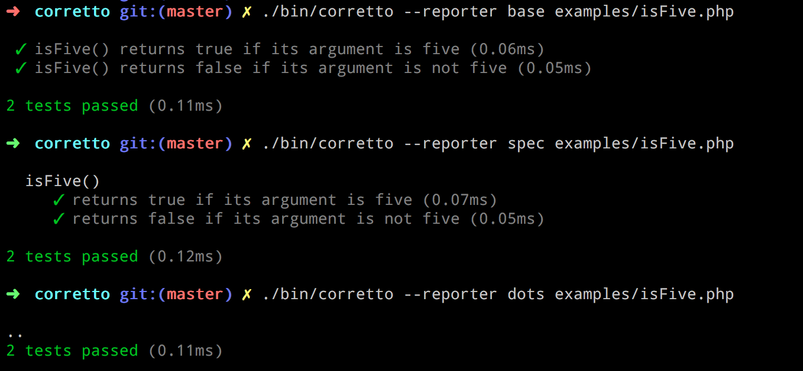

## Corretto

**Corretto** is a simple and expressive PHP test runner.

Modeled after [mocha](https://mochajs.org/), Corretto provides a DSL (domain-specific language) that makes writing tests easy. No need for classes and long function names; just say what your code does in plain words. After all, wouldn't you rather spend most of your time working on code rather than writing tests?

```php
<?php
use function Corretto\describe, Corretto\it, Corretto\assertTrue, Corretto\assertFalse;

describe( 'isFive()', function() {
	it( 'returns true if its argument is five', function() {
		assertTrue( isFive( 5 ) );
	} );

	it( 'returns false if its argument is not five', function() {
		assertFalse( isFive( 6 ) );
	} );
} );
```


## Installing

First you'll need [Composer](https://getcomposer.org/). Then, in your project:

```
composer require --dev sirbrillig/corretto
```

Or, to install globally:

```
composer global require sirbrillig/corretto
```

Just make sure your global vendor binaries directory is in your `$PATH`. See [the docs on global installs](https://getcomposer.org/doc/03-cli.md#global) for more info.

## Assertions

Corretto has built-in support for basic assertions:

- `assertTrue()`
- `assertFalse()`
- `assertEquals()`
- `assertNotEquals()`

It also supports expect syntax, which is recommended:

- `expect( $actual )->toBeTrue()`
- `expect( $actual )->toBeFalse()`
- `expect( $actual )->toEqual( $expected )`
- `expect( $actual )->toNotEqual( $expected )`
- `expect( $actual )->toBeGreaterThan( $expected )`
- `expect( $actual )->toBeLessThan( $expected )`
- `expect( $actual )->toContain( $expected )`
- `expect( $actual )->toNotContain( $expected )`

## Custom Assertions

Writing custom assertions is easy. Any function that throws an `Exception` counts as a test failure!

(You can also throw `\Corretto\AssertionFailure` which will provide slightly less noisy failures.)

To add new methods to `expect()`, you can use the function `extendExpectation()` which is passed an Expectation class. An Expectation class is any class with methods that should respond to the expectation. The class should also have a constructor that accepts the actual value.

Here's an example of adding `toContain()` to `expect()`:

```php
class ContainExpectation {
	function __construct( $actual ) {
		$this->actual = $actual;
	}

	public function toContain( $expected ) {
		$actual = $this->actual;
		if ( is_string( $actual ) && strpos( $actual, $expected ) === false ) {
			$expectedString = var_export( $expected, true );
			$actualString = var_export( $actual, true );
			throw new \Corretto\AssertionFailure( "Failed asserting that " . $actualString . " contains " . $expectedString . "" );
		}
		if ( is_array( $actual ) && ! in_array( $expected, $actual ) ) {
			$expectedString = var_export( $expected, true );
			$actualString = var_export( $actual, true );
			throw new \Corretto\AssertionFailure( "Failed asserting that " . $actualString . " contains " . $expectedString . "" );
		}
	}
}
```

Here's an example of registering that expectation:

```php
use function \Corretto\extendExpectation;
extendExpectation( '\Corretto\ContainExpectation' );
```

## Tests

A test is defined by the function `it( string $name, callable $callable )`. This function is also aliased as `test( string $name, callable $callable )` and `specify( string $name, callable $callable )`.

The callable should be an anonymous function that contains at least one assertion.

```php
it( 'does something', function() {
	...
} );
```

You can skip a test by simply omitting its callable, like this:

```php
it( 'does something not yet defined' );
```

You can also skip a test by adding the string `SKIP` as its first argument:

```php
it( 'SKIP', 'does something we should not run', function() {
	...
} );
```

## Suites

Tests can be organized into suites using a similar syntax to tests: `describe( string $name, callable $callable )`. This is also aliased as `suite( string $name, callable $callable )` and `context( string $name, callable $callable )`.

```php
describe( 'some tests to run', function() {
	test( '...' );
	test( '...' );
	test( '...' );
} );
```

There is a default "root" suite always defined, so tests can exist by themselves.

Suites can be nested as deep as makes sense.

```php
describe( 'MyObject', function() {
	describe( 'getName()', function() {
		describe( 'when the name is missing', function() {
			it( 'returns a default name', function() {
				$obj = new MyObject();
				expect( $obj->getName() )->toEqual( 'default' );
			} );
		} );

		describe( 'when the name is set', function() {
			it( 'returns the name', function() {
				$obj = new MyObject( 'name' );
				expect( $obj->getName() )->toEqual( 'name' );
			} );
		} );
	} );
} );
```

You can skip all the tests in a suite by adding the string `SKIP` as its first argument:

```php
describe( 'SKIP', 'some tests not to run', function() {
	...
} );
```

## Before, After

Suites can each have a `before( callable $callable )` which will be called before all the tests are run in that suite. Similarly `after( callable $callable )` will be run after all the tests have complete.

There is also `beforeEach( callable $callable )` and `afterEach( callable $callable )` which run their callables before/after each test in the suite (or any nested suite). These can be used to set up and restore data that is shared between each test.

```php
describe( 'MyObject', function() {
	$ctx = new \StdClass();
	beforeEach( function() use ( &$ctx ) {
		$ctx->color = 'blue';
	} );

	describe( 'getName()', function() use ( &$ctx ) {
		beforeEach( function() use ( &$ctx ) {
			$ctx->obj = new MyObject();
		} );

		it( 'returns a default name when the name is missing', function() use ( &$ctx ) {
			expect( $ctx->obj->getName() )->toEqual( 'default' );
		} );

		it( 'returns the name', function() use ( &$ctx ) {
			$ctx->obj->name = 'name';
			expect( $ctx->obj->getName() )->toEqual( 'name' );
		} );

		it( 'returns a name matching the color', function() use ( &$ctx ) {
			$ctx->obj->name = $ctx->color;
			expect( $ctx->obj->getName() )->toEqual( $ctx->color );
		} );
	} );
} );
```

Passing variables to closures with the `use` expression in PHP is verbose, and it's likely that this pattern will be used frequently in tests. To make this easier, each test and each `beforeEach`/`afterEach`/`before`/`after` function receives a shared object that can be used to pass data between functions. Here is that same series of tests with the object used instead of closures.

```php
describe( 'MyObject', function() {
	beforeEach( function( $ctx ) {
		$ctx->color = 'blue';
	} );

	describe( 'getName()', function() {
		beforeEach( function( $ctx ) {
			$ctx->obj = new MyObject();
		} );

		it( 'returns a default name when the name is missing', function( $ctx ) {
			expect( $ctx->obj->getName() )->toEqual( 'default' );
		} );

		it( 'returns the name', function( $ctx ) {
			$ctx->obj->name = 'name';
			expect( $ctx->obj->getName() )->toEqual( 'name' );
		} );

		it( 'returns a name matching the color', function( $ctx ) {
			$ctx->obj->name = $ctx->color;
			expect( $ctx->obj->getName() )->toEqual( $ctx->color );
		} );
	} );
} );
```

## Runner

The `corretto` command-line tool is used to execute the tests. It can be provided with a test file or a directory of test files. If no files are provided, it will default to looking for a directory called `tests` in the current directory.

The tool has several output options called **Reporters** that can be changed using the `-R` or `--reporter` options. The default Reporter is `spec` but there is also `base`, which is simpler, and `dots` which is more like the default output of PHPUnit.

It's possible to write a custom reporter very easily by extending `Corretto\Reporters\Base`. The Runner will emit events whenever something happens and a reporter can use those events as it likes.



## Examples

```php
<?php

use function Corretto\describe, Corretto\it;

use function Corretto\assertTrue, Corretto\assertFalse, Corretto\assertEquals, Corretto\assertNotEquals;

use function Corretto\test, Corretto\suite;

use function Corretto\specify, Corretto\context;

use function Corretto\beforeEach, Corretto\afterEach, Corretto\before, Corretto\after;

use function Corretto\expect;

it( 'allows tests outside a suite', function() {
	assertTrue( true );
} );

test( 'tests can use "test" as well as "it"', function() {
	assertTrue( true );
} );

specify( 'tests can use "specify" as well as "it"', function() {
	assertTrue( true );
} );

describe( 'describe()', function() {
	describe( 'when nested', function() {
		describe( 'more than once', function() {
			it( 'passes if its argument is true', function() {
				assertTrue( true );
			} );
		} );
		it( 'skips tests with no function' );
		it( 'SKIP', 'skips tests with the SKIP string as the first argument', function() {
			assertTrue( false );
		} );
		it( 'passes if its argument is true', function() {
			assertTrue( true );
		} );
	} );

	it( 'supports non-nested tests along with nested ones', function() {
		assertTrue( true );
	} );

	describe( 'when multiple tests are nested at the same level', function() {
		it( 'passes if its argument is true', function() {
			assertTrue( true );
		} );
	} );

	describe( 'SKIP', 'allows skipping whole suites', function() {
		it( 'passes if its argument is true', function() {
			assertTrue( false );
		} );
	} );
} );

context( 'a bunch of tests', function() {
	specify( 'suites can use "context" as well as "describe"', function() {
		assertTrue( true );
	} );
} );

suite( 'my tests', function() {
	test( 'suites can use "suite" as well as "describe"', function() {
		assertTrue( true );
	} );

	suite( 'there are many assertions', function() {
		test( 'assertEquals()', function() {
			$actual = 'expected';
			assertEquals( 'expected', $actual );
		} );

		test( 'assertNotEquals()', function() {
			$actual = 'actual';
			assertNotEquals( 'expected', $actual );
		} );

		test( 'assertTrue()', function() {
			assertTrue( true );
		} );

		test( 'assertFalse()', function() {
			assertFalse( false );
		} );
	} );

	suite( 'expectation syntax also works for assertions', function() {
		suite( 'expect()', function() {
			test( '->toBeTrue()', function() {
				expect( true )->toBeTrue();
			} );

			test( '->toBeFalse()', function() {
				expect( false )->toBeFalse();
			} );

			test( '->toEqual()', function() {
				expect( 'hi' )->toEqual( 'hi' );
			} );

			test( '->toNotEqual()', function() {
				expect( 'hi' )->toNotEqual( 'bye' );
			} );
		} );
	} );
} );

describe( 'set up and tear down', function() {
	$ctx = new \StdClass();

	describe( 'beforeEach()', function() use ( &$ctx ) {
		beforeEach( function() use ( &$ctx ) {
			$ctx->name = 'hello';
		} );

		it( 'sets up the test context', function() use ( &$ctx ) {
			expect( $ctx->name )->toEqual( 'hello' );
			$ctx->name = 'bye';
		} );

		it( 'runs again before each test', function() use ( &$ctx ) {
			expect( $ctx->name )->toNotEqual( 'bye' );
		} );
	} );

	describe( 'before()', function() use ( &$ctx ) {
		before( function() use ( &$ctx ) {
			$ctx->name = 'hello';
		} );

		it( 'sets up the test context', function() use ( &$ctx ) {
			expect( $ctx->name )->toEqual( 'hello' );
			$ctx->name = 'bye';
		} );

		it( 'runs only once before the suite runs', function() use ( &$ctx ) {
			expect( $ctx->name )->toEqual( 'bye' );
		} );
	} );

	describe( 'afterEach()', function() {
		$name = 'hello';
		afterEach( function() use ( &$name ) {
			$name = 'bye';
		} );

		it( 'is run after each test', function() use( &$name ) {
			expect( $name )->toEqual( 'hello' );
		} );

		it( 'runs again after each test', function() use ( &$name ) {
			expect( $name )->toEqual( 'bye' );
		} );
	} );

	$name = 'hello';
	describe( 'after()', function() use( &$name ) {
		after( function() use ( &$name ) {
			$name = 'bye';
		} );

		it( 'is run after all tests in a suite', function() use( &$name ) {
			expect( $name )->toEqual( 'hello' );
		} );
	} );

	describe( 'after() (continued)', function() use( &$name ) {
		it( 'is run at the end of a suite', function() use ( &$name ) {
			expect( $name )->toEqual( 'bye' );
		} );
	} );
} );
```
