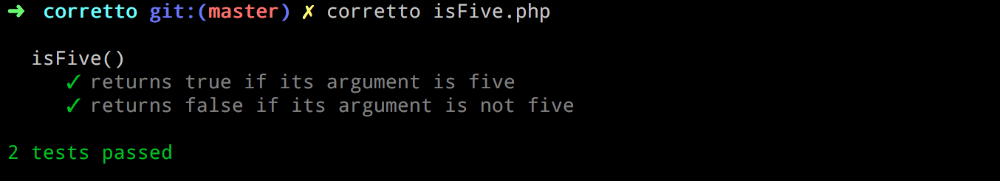

## Corretto

**Corretto** is a simple and expressive PHP test runner.

Modeled after [mocha](https://mochajs.org/), Corretto provides a DSL (domain-specific language) that makes writing tests easy. No need for classes and long function names; just say what your code does in plain words. After all, wouldn't you rather spend most of your time working on code rather than writing tests?

```php
<?php
use function \Corretto\{describe, it, assertTrue, assertFalse};

describe( 'isFive()', function() {
	it( 'returns true if its argument is five', function() {
		assertTrue( isFive( 5 ) );
	} );

	it( 'returns false if its argument is not five', function() {
		assertFalse( isFive( 6 ) );
	} );
} );
```



## Installing

First you'll need [Composer](https://getcomposer.org/). Then, in your project:

```
composer require --dev sirbrillig/corretto
```

Or, to install globally:

```
composer global require sirbrillig/corretto
```

Just make sure your global vendor binaries directory is in your `$PATH`. See [the docs on global installs](https://getcomposer.org/doc/03-cli.md#global) for more info.

## Assertions

Corretto has built-in support for the following assertions: `assertTrue()`, `assertFalse()`, `assertEquals()`, `assertNotEquals()`.

It also supports expect syntax: `expect( $actual )->toBeTrue()`, `expect( $actual )->toBeFalse()`, `expect( $actual )->toEqual( $expected )`, `expect( $actual )->toNotEqual( $expected )`.

Writing custom assertions is easy too. Anything that throws an `Exception` counts as a test failure!

(You can also throw `\Corretto\AssertionFailure` which will provide slightly less noisy failures.)

## Tests

A test is defined by the function `it( string $name, callable $callable )`. This function is also aliased as `test( string $name, callable $callable )` and `specify( string $name, callable $callable )`.

The callable should be an anonymous function that contains at least one assertion.

```php
it( 'does something', function() {
	...
} );
```

You can skip a test by simply omitting its callable, like this:

```php
it( 'does something not yet defined' );
```

You can also skip a test by adding the string `SKIP` as its first argument:

```php
it( 'SKIP', 'does something we should not run', function() {
	...
} );
```

## Suites

Tests can be organized into suites using a similar syntax to tests: `describe( string $name, callable $callable )`. This is also aliased as `suite( string $name, callable $callable )` and `context( string $name, callable $callable )`.

```php
describe( 'some tests to run', function() {
	test( '...' );
	test( '...' );
	test( '...' );
} );
```

There is a default "root" suite always defined, so tests can exist by themselves.

Suites can be nested as deep as makes sense.

```php
describe( 'MyObject', function() {
	describe( 'getName()', function() {
		describe( 'when the name is missing', function() {
			it( 'returns a default name', function() {
				$obj = new MyObject();
				expect( $obj->getName() )->toEqual( 'default' );
			} );
		} );

		describe( 'when the name is set', function() {
			it( 'returns the name', function() {
				$obj = new MyObject( 'name' );
				expect( $obj->getName() )->toEqual( 'name' );
			} );
		} );
	} );
} );
```

You can skip all the tests in a suite by adding the string `SKIP` as its first argument:

```php
describe( 'SKIP', 'some tests not to run', function() {
	...
} );
```

## Before, After

Suites can each have a `before( callable $callable )` which will be called before all the tests are run in that suite. Similarly `after( callable $callable )` will be run after all the tests have complete.

There is also `beforeEach( callable $callable )` and `afterEach( callable $callable )` which run their callables before/after each test in the suite. These can bse used to set up and restore data that is shared between each test.

```php
describe( 'MyObject', function() {
	$ctx = new \StdClass();
	describe( 'getName()', function() use ( &$ctx ) {
		beforeEach( function() use ( &$ctx ) {
			$ctx->obj = new MyObject();
		} );

		it( 'returns a default name when the name is missing', function() use ( &$ctx ) {
			expect( $ctx->obj->getName() )->toEqual( 'default' );
		} );

		it( 'returns the name', function() use ( &$ctx ) {
			$ctx->obj->name = 'name';
			expect( $ctx->obj->getName() )->toEqual( 'name' );
		} );
	} );
} );
```

## Runner

The `corretto` command-line tool is used to execute the tests. It can be provided with a test file or a directory of test files. If no files are provided, it will default to looking for a directory called `tests` in the current directory.

The tool has several output options called **Reporters** that can be changed using the `-R` or `--reporter` options. The default Reporter is `spec` but there is also `base`, which is simpler, and `dots` which is more like the default output of PHPUnit.

## Examples

```php
<?php

use function \Corretto\{describe, it};
use function \Corretto\{test, suite};
use function \Corretto\{context, specify};
use function \Corretto\{assertTrue, assertFalse, assertEquals, assertNotEquals};
use function \Corretto\{expect};
use const \Corretto\SKIP;

it( 'allows tests outside a suite', function() {
	assertTrue( true );
} );

test( 'tests can use "test" as well as "it"', function() {
	assertTrue( true );
} );

specify( 'tests can use "specify" as well as "it"', function() {
	assertTrue( true );
} );

describe( 'describe()', function() {
	describe( 'when nested', function() {
		describe( 'more than once', function() {
			it( 'passes if its argument is true', function() {
				assertTrue( true );
			} );
		} );
		it( 'skips tests with no function' );
		it( SKIP, 'skips tests with the SKIP constant as the first argument', function() {
			assertTrue( false );
		} );
		it( 'passes if its argument is true', function() {
			assertTrue( true );
		} );
	} );

	it( 'supports non-nested tests along with nested ones', function() {
		assertTrue( true );
	} );

	describe( 'when multiple tests are nested at the same level', function() {
		it( 'passes if its argument is true', function() {
			assertTrue( true );
		} );
	} );

	describe( SKIP, 'allows skipping whole suites', function() {
		it( 'passes if its argument is true', function() {
			assertTrue( false );
		} );
	} );
} );

context( 'a bunch of tests', function() {
	specify( 'suites can use "context" as well as "describe"', function() {
		assertTrue( true );
	} );
} );

suite( 'my tests', function() {
	test( 'suites can use "suite" as well as "describe"', function() {
		assertTrue( true );
	} );

	suite( 'there are many assertions', function() {
		test( 'assertEquals()', function() {
			$actual = 'expected';
			assertEquals( 'expected', $actual );
		} );

		test( 'assertNotEquals()', function() {
			$actual = 'actual';
			assertNotEquals( 'expected', $actual );
		} );

		test( 'assertTrue()', function() {
			assertTrue( true );
		} );

		test( 'assertFalse()', function() {
			assertFalse( false );
		} );
	} );

	suite( 'expectation syntax also works for assertions', function() {
		suite( 'expect()', function() {
			test( '->toBeTrue()', function() {
				expect( true )->toBeTrue();
			} );

			test( '->toBeFalse()', function() {
				expect( false )->toBeFalse();
			} );

			test( '->toEqual()', function() {
				expect( 'hi' )->toEqual( 'hi' );
			} );

			test( '->toNotEqual()', function() {
				expect( 'hi' )->toNotEqual( 'bye' );
			} );
		} );
	} );
} );
```
